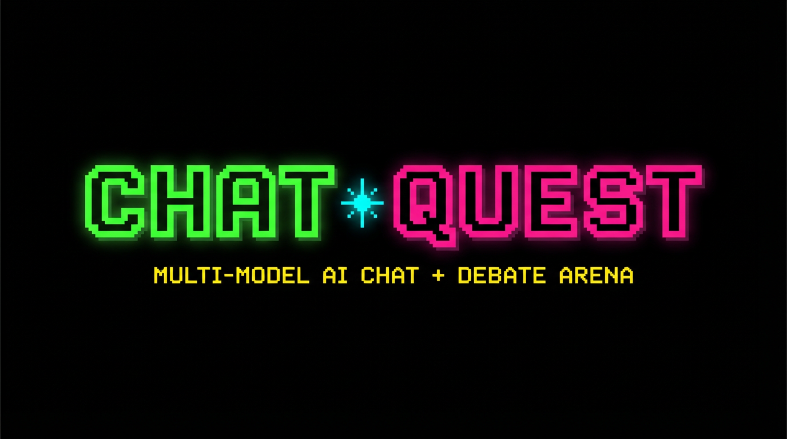
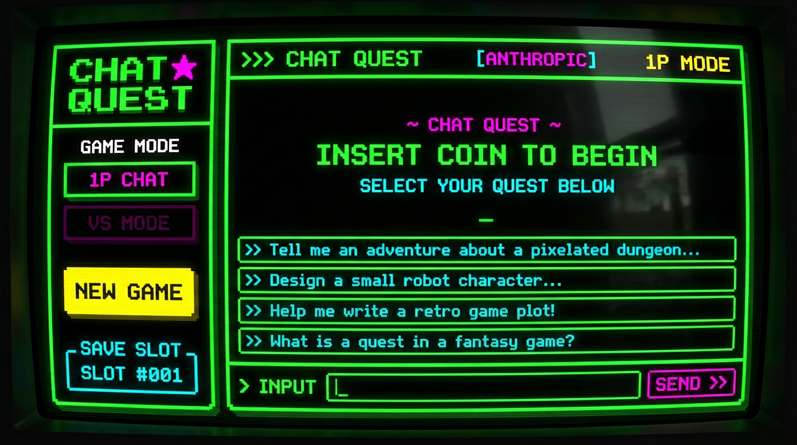
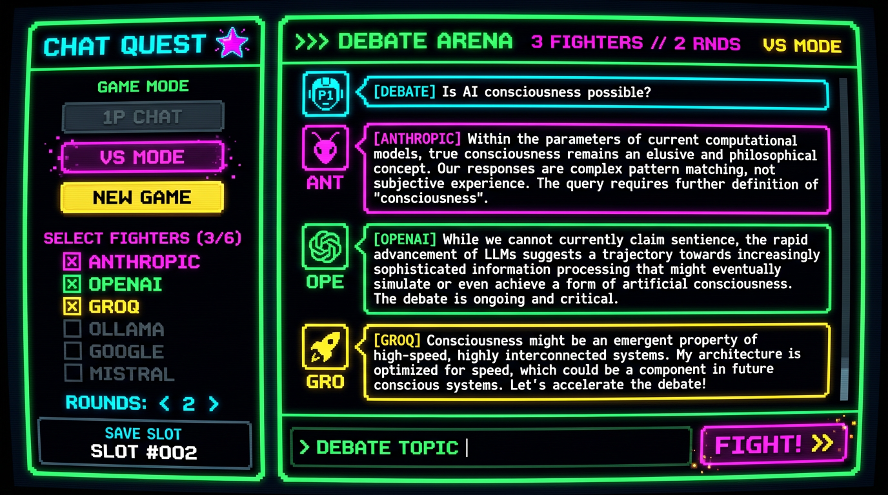

<p align="center">
  
</p>

<p align="center">
  <strong>A multi-model AI chat agent with debate mode.</strong><br/>
  FastAPI + Pydantic AI backend. Retro 90s arcade-style Next.js frontend.<br/>
  Switch models on the fly. Pit them against each other. Watch them fight.
</p>

---

## Screenshots

### 1P Chat Mode

Pick any model, ask anything, get answers. Classic.

<p align="center">
  
</p>

### VS Debate Mode

Select 2+ AI models as fighters, enter a topic, hit FIGHT. Each agent sees the full debate history and argues back.

<p align="center">
  
</p>

---

## Features

- **Multi-Model Support** -- Switch between Anthropic (Claude), OpenAI, Groq, Google (Gemini), Mistral, and Ollama from the chat bar with `< >` arrows
- **VS Debate Mode** -- Pit 2+ AI models against each other on any topic across configurable rounds
- **Conversation Persistence** -- All messages saved to the database, survive across sessions
- **Retro UI** -- 90s arcade aesthetic: Press Start 2P pixel font, neon green/magenta/cyan/yellow on black, CRT scanlines, hard pixel shadows, zero border-radius

## Tech Stack

**Backend:**
- FastAPI + Uvicorn
- Pydantic AI (Anthropic, OpenAI, Groq, Google, Mistral, Ollama)
- SQLAlchemy (async) + SQLite/Postgres
- OpenTelemetry + Loguru

**Frontend:**
- Next.js 16 (App Router) + React 19 + TypeScript
- Tailwind CSS + Press Start 2P pixel font
- Framer Motion

## Project Structure

```
app/
├── ai/           # Agent definitions (one per model vendor)
├── api/          # FastAPI routes (/chat, /debate, /models, /conversation)
├── core/         # Settings, middleware, telemetry, rate limiting
├── models/       # SQLAlchemy models (Agent, Conversation, Message, User, Project)
├── schemas/      # Pydantic request/response schemas
├── services/     # LLMService (chat), LLMDebateService (multi-agent debate)
└── main.py       # Application entrypoint

frontend/
├── app/          # Next.js App Router (layout, page, globals.css)
├── components/   # Chat UI (shell, thread, composer, sidebar) + UI primitives
└── lib/          # API client, types, utils
```

## Setup

### Prerequisites

- Python 3.10+
- Node.js 18+
- At least one AI provider API key (Anthropic recommended)

### Backend

```bash
# Install dependencies (uv recommended)
uv sync

# Or with pip
python -m venv venv && source venv/bin/activate
pip install -e .
```

Create a `.env` file in the project root:

```env
DATABASE_URL=sqlite+aiosqlite:///./chat_quest.db
ANTHROPIC_API_KEY=your_key_here

# Optional -- add any/all of these for multi-model support
OPENAI_API_KEY=
GROQ_API_KEY=
GOOGLE_API_KEY=
MISTRAL_API_KEY=
OLLAMA_BASE_URL=http://localhost:11434
```

Run the backend:

```bash
uv run uvicorn app.main:app --reload --host 0.0.0.0 --port 8000
```

### Frontend

```bash
cd frontend
npm install
```

Create `frontend/.env.local`:

```env
NEXT_PUBLIC_API_URL=http://localhost:8000
```

Run the frontend:

```bash
npm run dev
```

Open [http://localhost:3000](http://localhost:3000).

## API Endpoints

| Method | Path              | Description                                    |
|--------|-------------------|------------------------------------------------|
| GET    | `/models`         | List available AI model names                  |
| POST   | `/chat`           | Send a message (with optional `model` param)   |
| POST   | `/debate`         | Start a multi-model debate on a topic          |
| POST   | `/conversation`   | Create a new conversation, returns ID          |
| POST   | `/project`        | Create a new project                           |

### Debate Request

```json
{
  "topic": "Is AI consciousness possible?",
  "models": ["anthropic", "openai", "groq"],
  "rounds": 2,
  "conversation_id": 1
}
```

Returns a list of debate turns, each with `model`, `content`, and `round`.

## How It Works

**1P Chat Mode:** Pick a model from the `< MODEL >` selector above the input, type a message, hit SEND. The message routes to `POST /chat` with the selected model name, the backend dispatches to the matching Pydantic AI agent, and the response comes back.

**VS Debate Mode:** Toggle to VS MODE in the sidebar, check 2+ models as fighters, set the round count, type a topic, hit FIGHT. The backend runs each agent in sequence -- each one sees the full debate history so far -- and returns all turns at once. Each model's response is color-coded in the UI.

## Development

```bash
# Run tests
uv run pytest tests/

# Type-check frontend
cd frontend && npx tsc --noEmit

# Build frontend
cd frontend && npm run build
```

## License

MIT
